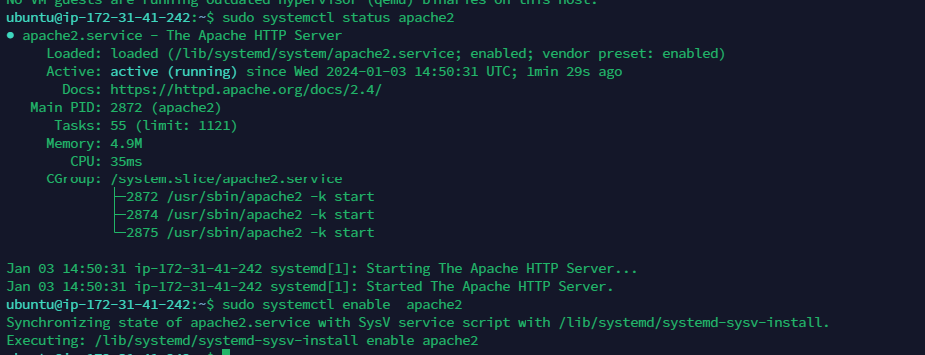

"# WEB-STACK-IMPLEMENTATION-LAMP-STACK-IN-AWS" 

###WEB STACK IMPLEMENTATION (LAMP STACK) IN AWS
Introduction
Welcome to your first Project-Based Learning (PBL) project in DevOps. This guide will walk you through implementing a LAMP Stack on AWS.

What is a Technology Stack?
A technology stack is a set of software tools and frameworks used in the development and deployment of software products. Common stacks include LAMP, LEMP, MERN, and MEAN.

Goals and Learning Outcomes
After completing this project, you will:

Be proficient in the Linux Terminal.
Understand different Web Technology stacks.
Have solid Linux administration skills.
Be familiar with AWS for hosting websites.
Be adept at using Google Search for troubleshooting.

Side Self-Study
Research and familiarize yourself with:

Software Development Life Cycle (SDLC).
The LAMP stack.
Linux commands 'chmod' and 'chown'.
TCP and UDP protocols.
Text editing in Vi (Vim) editor.
Instructions for Work Submission
Follow the provided instructions and videos for workspace setup.

Step 0 - Preparing Prerequisites
Setting up AWS and EC2 Instance
Create an AWS Account: Register and set up an AWS account. AWS Account Setup Link
Launch an EC2 Instance: Choose Ubuntu Server 20.04 LTS for your instance.
Image for reference:
Secure Your Private Key: Store your .pem file in a secure location.
Connecting to EC2 Instance (Windows)
Download Putty from Putty Download Link.
Use the following command to connect:

```bash
ssh -i <private-key-name>.pem ubuntu@<Public-IP-address>

```
Step 1 - Installing Apache and Updating the Firewall
Install Apache:

```bash
sudo apt update
sudo apt install apache2

```
Verify Apache Installation:
```bash
sudo systemctl status apache2
```

