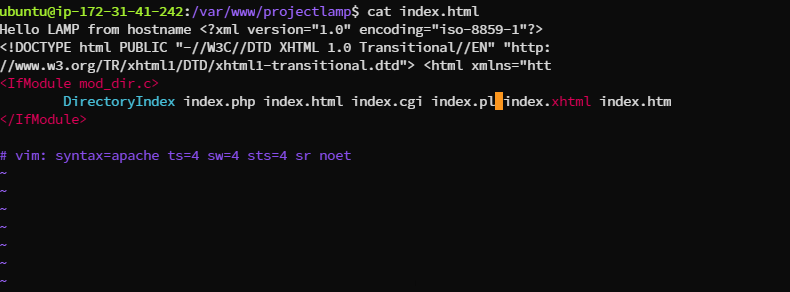
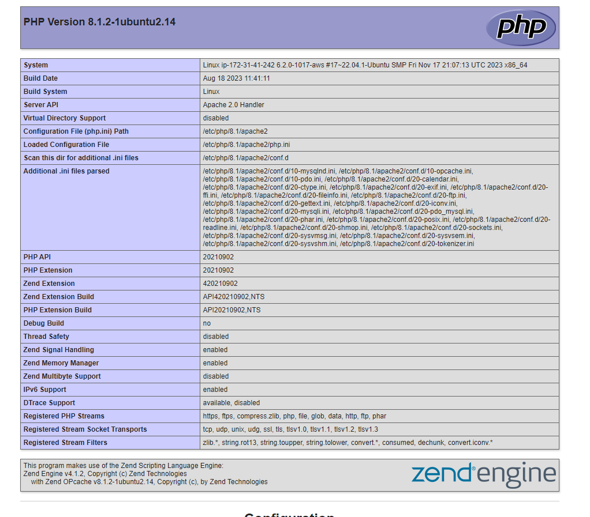

"# WEB-STACK-IMPLEMENTATION-LAMP-STACK-IN-AWS" 

###WEB STACK IMPLEMENTATION (LAMP STACK) IN AWS
Introduction
Welcome to your first Project-Based Learning (PBL) project in DevOps. This guide will walk you through implementing a LAMP Stack on AWS.

What is a Technology Stack?
A technology stack is a set of software tools and frameworks used in the development and deployment of software products. Common stacks include LAMP, LEMP, MERN, and MEAN.

Goals and Learning Outcomes
After completing this project, you will:

Be proficient in the Linux Terminal.
Understand different Web Technology stacks.
Have solid Linux administration skills.
Be familiar with AWS for hosting websites.
Be adept at using Google Search for troubleshooting.

Side Self-Study
Research and familiarize yourself with:

Software Development Life Cycle (SDLC).
The LAMP stack.
Linux commands 'chmod' and 'chown'.
TCP and UDP protocols.
Text editing in Vi (Vim) editor.
Instructions for Work Submission
Follow the provided instructions and videos for workspace setup.

### Step 0 - Preparing Prerequisites
Setting up AWS and EC2 Instance
Create an AWS Account: Register and set up an AWS account. AWS Account Setup Link
Launch an EC2 Instance: Choose Ubuntu Server 20.04 LTS for your instance.
Image for reference:
Secure Your Private Key: Store your .pem file in a secure location.
Connecting to EC2 Instance (Windows)
Download Putty from Putty Download Link.
Use the following command to connect:

```bash
ssh -i <private-key-name>.pem ubuntu@<Public-IP-address>

```
### Step 1 - Installing Apache and Updating the Firewall
Install Apache:

```bash
sudo apt update
sudo apt install apache2

```
Verify Apache Installation:
```bash
sudo systemctl status apache2
```


### Step 2 - Installing MySQL
Install MySQL:

```bash
sudo apt install mysql-server
```

log in to the MySQL console by typing:
```bash
sudo mysql
```


It’s recommended that you run a security script that comes pre-installed with MySQL. This script will remove some insecure default settings and lock down access to your database system. Before running the script you will set a password for the root user, using mysql_native_password as default authentication method. We’re defining this user’s password as PassWord.1

```bash
ALTER USER 'root'@'localhost' IDENTIFIED WITH mysql_native_password BY 'PassWord.1';
```

Exit the MYSQL Shell with 
```bash
mysql> exit
```
start the interactive script by running 
```bash
sudo mysql_secure_installation
```
This will ask if you want to configure the VALIDATE PASSWORD PLUGIN.
# Note: Enabling this feature is something of a judgment call. If enabled, passwords which don’t match the specified criteria will be rejected by MySQL with an error. It is safe to leave validation disabled, but you should always use strong, unique passwords for database credentials.
Answer Y for yes, or anything else to continue without enabling.


```bash
VALIDATE PASSWORD PLUGIN can be used to test passwords
and improve security. It checks the strength of password
and allows the users to set only those passwords which are
secure enough. Would you like to setup VALIDATE PASSWORD plugin?

Press y|Y for Yes, any other key for No:
```

If you answer “yes”, you’ll be asked to select a level of password validation. Keep in mind that if you enter 2 for the strongest level, you will receive errors when attempting to set any password which does not contain numbers, upper and lowercase letters, and special characters, or which is based on common dictionary words e.g PassWord.1.

```bash
There are three levels of password validation policy:

LOW    Length >= 8
MEDIUM Length >= 8, numeric, mixed case, and special characters
STRONG Length >= 8, numeric, mixed case, special characters and dictionary              file

Please enter 0 = LOW, 1 = MEDIUM and 2 = STRONG: 1
```

Regardless of whether you chose to set up the VALIDATE PASSWORD PLUGIN, your server will next ask you to select and confirm a password for the MySQL root user. This is not to be confused with the system root. The database root user is an administrative user with full privileges over the database system. Even though the default authentication method for the MySQL root user dispenses the use of a password, even when one is set, you should define a strong password here as an additional safety measure. We’ll talk about this in a moment.
If you enabled password validation, you’ll be shown the password strength for the root password you just entered and your server will ask if you want to continue with that password. If you are happy with your current password, enter Y for “yes” at the prompt:

```bash
Estimated strength of the password: 100 
Do you wish to continue with the password provided?(Press y|Y for Yes, any other key for No) : y
```

For the rest of the questions, press Y and hit the ENTER key at each prompt. This will prompt you to change the root password, remove some anonymous users and the test database, disable remote root logins, and load these new rules so that MySQL immediately respects the changes you have made.
When you’re finished, test if you’re able to log in to the MySQL console by typing:

```bash
sudo mysql -p
```


Notice the -p flag in this command, which will prompt you for the password used after changing the root user password.
To exit the MySQL console, type:

```bash
mysql> exit
```

Note that a password is needed to connect as the root user.

### Step 3 — Installing PHP

Apache installed to serve  content and MySQL installed to store and manage  data. PHP is the component of our setup that will process code to display dynamic content to the end user. In addition to the php package, one will need php-mysql, a PHP module that allows PHP to communicate with MySQL-based databases. You’ll also need libapache2-mod-php to enable Apache to handle PHP files. Core PHP packages will automatically be installed as dependencies.
To install these 3 packages at once, run:


```bash 
sudo apt install php libapache2-mod-php php-mysql
```

once installation is complete, run 

```bash
php -v
```


At this point, the LAMP stack is completely installed and fully operational.

- [x] Linux (Ubuntu)
- [x] Apache HTTP Server
- [x] MySQL
- [x] PHP

To test the setup with a PHP script, it’s best to set up a proper Apache Virtual Host to hold the website’s files and folders. Virtual host allows you to have multiple websites located on a single machine and users of the websites will not even notice it.
We will create our virtual host in the steps below.

### Step 4 — Creating a Virtual Host for  Website using Apache

In this project, I will set up a domain called projectlamp, but you can replace this with any domain of your choice.
Apache on Ubuntu 20.04 has one server block enabled by default that is configured to serve documents from the /var/www/html directory.
We will leave this configuration as is and will add our own directory next next to the default one.
Create the directory for projectlamp using 'mkdir' command as follows:

```bash
sudo mkdir /var/www/projectlamp
```
Next, assign ownership of the directory with the $USER environment variable, which will reference your current system user:

```bash
sudo chown -R $USER:$USER /var/www/projectlamp
```
Then, create and open a new configuration file in Apache’s sites-available directory using your preferred command-line editor. Here, we’ll be using vi or vim (They are the same by the way):

```bash
sudo vi /etc/apache2/sites-available/projectlamp.conf
```
This will create a new blank file. Paste in the following bare-bones configuration by hitting on i on the keyboard to enter the insert mode, and paste the text:

To save and close the file, simply follow the steps below:
1.  Hit the esc button on the keyboard
2.  Type :
3.  Type wq. w for write and q for quit
4.  Hit ENTER to save the file

You can use the ls command to show the new file in the sites-available directory

```bash
$ sudo ls /etc/apache2/sites-available
You will see something like this
000-default.conf  default-ssl.conf  projectlamp.conf
```
With this VirtualHost configuration, we’re telling Apache to serve projectlamp using /var/www/projectlampl as its web root directory. If you would like to test Apache without a domain name, you can remove or comment out the options ServerName and ServerAlias by adding a # character in the beginning of each option’s lines. Adding the # character there will tell the program to skip processing the instructions on those lines.

You can now use <em><strong>a2ensite</strong></em> command to enable the new virtual host:

``` bash
sudo a2ensite projectlamp
```
You might want to disable the default website that comes installed with Apache. This is required if you’re not using a custom domain name, because in this case Apache’s default configuration would overwrite your virtual host. To disable Apache’s default website use a2dissite command , type:

```bash
sudo a2dissite 000-default
```
To make sure your configuration file doesn’t contain syntax errors, run:

```bash
sudo apache2ctl configtest
```
Finally, reload Apache so these changes take effect:
```bash
sudo systemctl reload apache2
```

Your new website is now active, but the web root /var/www/projectlamp is still empty. Create an index.html file in that location so that we can test that the virtual host works as expected:

```bash
sudo echo 'Hello LAMP from hostname' $(curl -s http://169.254.169.254/latest/meta-data/public-hostname) 'with public IP' $(curl -s http://169.254.169.254/latest/meta-data/public-ipv4) > /var/www/projectlamp/index.html
```

Now go to your browser and try to open your website URL using IP address:

```bash
http://<Public-IP-Address>:80
```

```bash
http://<Public-DNS-Name>:80
```
You can leave this file in place as a temporary landing page for your application until you set up an index.php file to replace it. Once you do that, remember to remove or rename the index.html file from your document root, as it would take precedence over an index.php file by default.

### Step 5 — Enable PHP on the website
With the default DirectoryIndex settings on Apache, a file named index.html will always take precedence over an index.php file. This is useful for setting up maintenance pages in PHP applications, by creating a temporary index.html file containing an informative message to visitors. Because this page will take precedence over the index.php page, it will then become the landing page for the application. Once maintenance is over, the index.html is renamed or removed from the document root, bringing back the regular application page.
In case you want to change this behavior, you’ll need to edit the <em><strong>/etc/apache2/mods-enabled/dir.conf<em></strong> file and change the order in which the index.php file is listed within the DirectoryIndex directive:

```bash
<IfModule mod_dir.c>
        #Change this:
        #DirectoryIndex index.html index.cgi index.pl index.php index.xhtml index.htm
        #To this:
        DirectoryIndex index.php index.html index.cgi index.pl index.xhtml index.htm
</IfModule>
```



After saving and closing the file, you will need to reload Apache so the changes take effect:
```bash
$ sudo systemctl reload apache2
```

Finally, we will create a PHP script to test that PHP is correctly installed and configured on the  server.
Now that there is a custom location to host the website’s files and folders, we’ll create a PHP test script to confirm that Apache is able to handle and process requests for PHP files.
Create a new file named index.php inside the custom web root folder

```bash
$ vim /var/www/projectlamp/index.php
```
This will open a blank file. Add the following text, which is valid PHP code, inside the file:

```bash
<?php
phpinfo();
```
Reload Apache2
```bash
sudo systemctl reload apache2
```
Save the file and refresh the page getting the page below.



This page provides information about your server from the perspective of PHP. It is useful for debugging and to ensure that your settings are being applied correctly.
If you can see this page in your browser, then your PHP installation is working as expected.
After checking the relevant information about your PHP server through that page, it’s best to remove the file you created as it contains sensitive information about your PHP environment -and your Ubuntu server. You can use rm to do so:
```bash
$ sudo rm /var/www/projectlamp/index.php
```

####    Congratulations, You have finished your very first REAL LIFE PROJECT by deploying a LAMP stack website in AWS Cloud!
